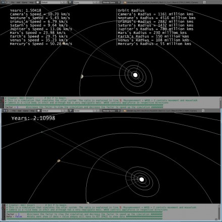

# Planetary-Simulation

Hit P to begin.

Simulation based on newtonian gravity. The following is not animated but rather a physics simulation. Props to the awesomeness that is Bullet Physics.

This simulation simulates the solar system. Since there are 9 objects there are a total of 72 forces every frame created by a looping fucntion in gravity.py. The ratio is explained in line 5. Mouse-movement + WASD + Z (telescope) controls movement and mouse-look

Camera is a rijid body in orbit and although has a very negligible mass. WASD controls apply Force in respective directions

increase the factor to slow the simulation and decrease the factor to speed up the simulation

stats wont show if data = false and you will have to HIT SPACE to show data.

Tutorial:

http://www.youtube.com/watch?v=8C8VHI0xWoM
